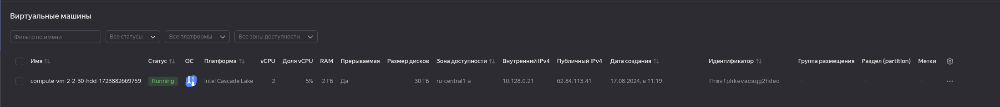
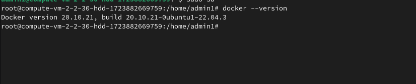

# Домашнее задание к занятию 1. «Введение в виртуализацию»
### Цели задания
1. Научиться запускать виртуальную машину в Yandex Cloud с минимальным расходом ресурсов.
2. Попрактиковаться в выборе платформы  и системы управления виртуализации для решения требуемых задач.
## Задача 1 ##
1. Создайте через web-интерфейс Yandex Cloud - VPC и виртуальную машину из инструкции конфигурации "эконом-ВМ" с публичным ip-адресом. В пункте "Выбор образа/загрузочного диска" выберите вкладку "Cloud Marketplace" , щелкните "Посмотреть больше", найдите образ "Yandex Cloud Toolbox".
2. Убедитесь, что вы можете подключиться к консоли ВМ через ssh, используя публичный ip-адрес. Убедитесь, что на ВМ установлен Docker с помощью команды ```docker --version```(команду выполните от имени root пользователя) !
3. Узнайте в инструкции Яндекс, какие еще инструменты предустановлены в данном образе.
4. Оставьте ВМ работать, пока она не выключится самостоятельно! Опция "прерываемая" выключит ее не позже чем через 24 часа. 
5. Для наглядности подождите еще 1 сутки.
6. Перейдите по [ссылке ](https://console.cloud.yandex.ru/billing?section=accounts). Выберите свой платежный аккаунт. Перейдите на вкладку детализация (фильтр "По продуктам") и оцените график потребления финансов.
7. Удалите ВМ или пользуйтесь ею при выполнении последующих домашних заданий курса обучения.  

### Выполнение




